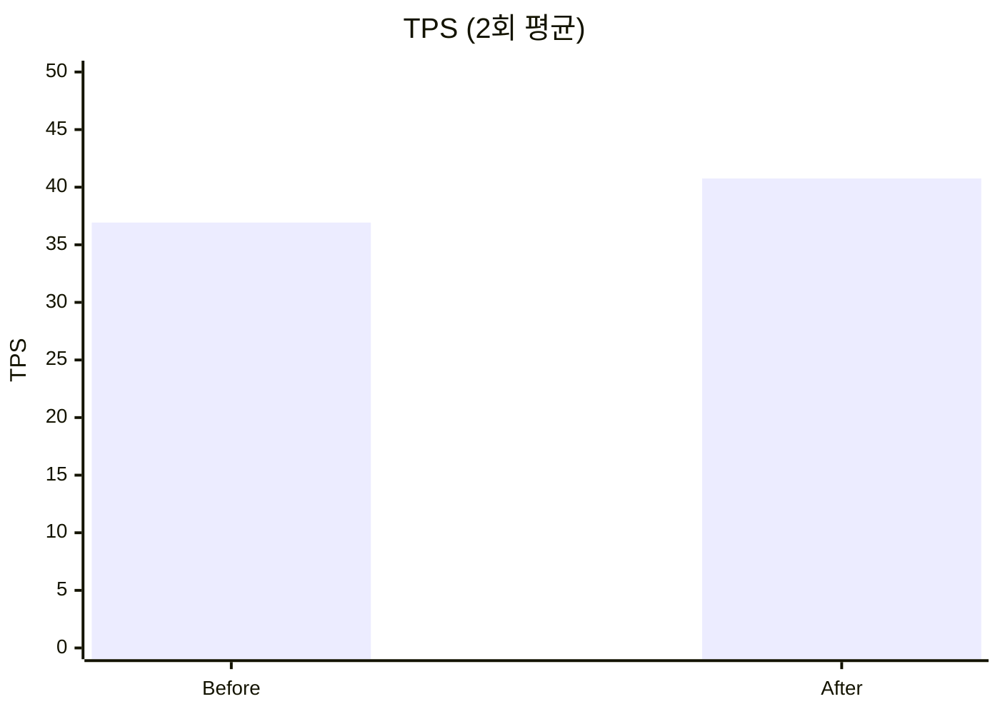
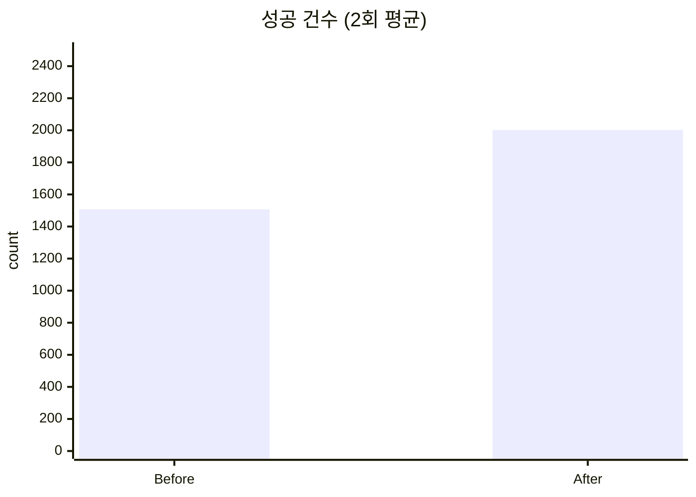

# Concurrent Banking API


뱅킹 도메인의 **동시성·정합성·멱등성** 문제를 실무 수준의 정합성 요구사항을 구현한 Spring Boot 백엔드 API.
계좌 개설부터 이체까지의 거래 흐름을 **레이어드 락 · 감사 로그 · 거래 한도 · 상태 머신** 위에 구현했습니다.

---

## 📌 핵심 특징

| 영역 | 구현 |
|---|---|
| 인증 | JWT Access Token (15분) + Refresh Token (7일, RTR) |
| 동시성 | **Redisson 분산 락** + DB `PESSIMISTIC_WRITE` 이중 방어, 계좌번호 정렬 락 획득 (데드락 방지) |
| 계좌 상태 | `ACTIVE` / `DORMANT` / `FROZEN` — 도메인 상태 머신, 비정상 상태에서 거래 차단 |
| 거래 한도 | 1회 1,000만원 / 1일 5,000만원 — 시중은행 비대면 한도를 참고한 기본값 (`application.yml`에서 조정) |
| 멱등성 | `Idempotency-Key` 헤더 기반 필터 + MySQL `UNIQUE` 제약으로 원자적 선점, 응답 재생(24h 보관·03시 스위핑) |
| 보안 | Rate Limiting (Bucket4j), PII 마스킹 (계좌번호 `100-****5678`), Stateless 세션 |
| 감사 | 모든 금융 거래·인증 이벤트를 독립 트랜잭션(`REQUIRES_NEW`)으로 AuditLog 기록 |
| 문서 | SpringDoc OpenAPI 3 (Swagger UI) |

---

## 🛠 기술 스택

- **Language / Runtime**: Java 21, Spring Boot 3.4.3
- **Persistence**: Spring Data JPA, MySQL 8 (스키마는 Flyway 마이그레이션, `ddl-auto=validate`)
- **Distributed Lock**: Redis 7 + Redisson 3.37 (이체 경합용)
- **Idempotency Store**: MySQL (`UNIQUE` 제약 기반 선점, `MEDIUMTEXT` 응답 영속화)
- **Security**: Spring Security, JJWT 0.11.5
- **API Docs**: SpringDoc OpenAPI 2.8.5
- **Rate Limiting**: Bucket4j 8.10.1
- **Build / Test**: Gradle, JUnit 5, Mockito, H2 (테스트)

---

## 🏗 아키텍처

```
Client ──HTTP──► [TraceIdFilter → RateLimitFilter → JwtAuthFilter → IdempotencyFilter]
                                                           │          │
                                                           │     MySQL (UNIQUE idempotency_keys)
                                                           ▼
                                      Controller ─► Service
                                                           │
                              ┌────────────────────────────┼────────────────────────────┐
                              ▼                            ▼                            ▼
                      Redisson 분산 락              JPA Repository                AuditLogService
                              │                            │                      (REQUIRES_NEW)
                              ▼                            ▼
                          Redis                MySQL (SELECT ... FOR UPDATE)
```

### 패키지 구성
```
com.bank
├── controller      REST 엔드포인트
├── service         비즈니스 로직
├── lock            분산 락 (DistributedLockManager / Redisson 구현)
├── policy          거래 한도 등 도메인 정책
├── entity          JPA 엔티티 (User, Account, Transaction, AuditLog, RefreshToken, IdempotencyKey)
├── repository      Spring Data JPA
├── security        JWT 발급 / 검증, SecurityConfig
├── filter          TraceId, RateLimit 필터
├── idempotency     Idempotency 필터 + DbIdempotencyStore (UNIQUE 선점) + 24h 정리 스케줄러
├── exception       커스텀 예외 + GlobalExceptionHandler
├── dto             Request / Response DTO
├── domain          BaseTimeEntity (Auditing)
├── config          Redis, Redisson, Filter 설정 + @ConfigurationProperties
└── util            LogMaskingUtil (PII 마스킹)
```

---

## 🔑 주요 API

### Auth
| Method | Path | 설명 |
|---|---|---|
| POST | `/auth/signup` | 회원가입 |
| POST | `/auth/login` | 로그인 (AT + RT 발급, Rate Limited 5/min) |
| POST | `/auth/refresh` | 토큰 갱신 (RTR) |
| POST | `/auth/logout` | 로그아웃 (RT 전체 삭제) |

### Account
| Method | Path | 설명 |
|---|---|---|
| POST | `/accounts` | 계좌 개설 |
| GET | `/accounts` | 내 계좌 목록 |
| GET | `/accounts/{accountNumber}` | 계좌 조회 |
| GET | `/accounts/{accountNumber}/balance` | 잔액 조회 |
| POST | `/accounts/{accountNumber}/freeze` | 계좌 동결 (분실신고 등) |
| POST | `/accounts/{accountNumber}/unfreeze` | 동결 해제 |
| POST | `/accounts/{accountNumber}/activate` | 휴면 계좌 활성화 |

### Transaction / Transfer
| Method | Path | 설명 |
|---|---|---|
| POST | `/transactions` | 입금 / 출금 (Idempotency-Key 필수) |
| GET | `/transactions/{accountNumber}` | 거래 내역 (페이징) |
| POST | `/transfers` | 계좌 이체 (Idempotency-Key 필수) |

Swagger UI: `http://localhost:8080/swagger-ui.html`

---

## 🔒 핵심 설계 의사결정

### 1. 비관적 락 (PESSIMISTIC_WRITE) 선택 이유
계좌 도메인은 동일 리소스에 대한 **경합 빈도가 높고 실패 시 재시도 비용이 큰** 워크로드입니다.
낙관적 락(`@Version`)은 충돌 시 `OptimisticLockException` → 재시도 루프를 거치는데, 이체처럼 2개 계좌를 원자적으로 다뤄야 하는 경우 재시도가 복잡해집니다.
따라서 DB 수준에서 행을 직렬화하는 비관적 락을 채택하여 **로직 단순성 + 정합성**을 확보했습니다.

### 2. 데드락 방지 — 계좌번호 정렬
두 계좌를 락 걸 때 **항상 계좌번호 사전순**으로 락을 획득합니다.
A→B 이체와 B→A 이체가 동시에 발생해도 락 순서가 동일하므로 데드락이 발생하지 않습니다.
→ `TransferConcurrencyTest` 에서 검증.

### 3. Redisson 분산 락 (다중 인스턴스 대비)
단일 인스턴스에서는 DB 비관적 락만으로도 정합성이 유지되지만, **수평 확장 시 DB에만 의존하면 대기 큐가 DB 커넥션에 쌓여 장애 전파 위험**이 있습니다.
- Redis(Redisson) 기반 분산 락을 **DB 락보다 앞단에 배치** → 앱 레벨에서 먼저 직렬화.
- DB 비관적 락은 그대로 유지하여 **이중 방어(layered locking)**: 분산 락 만료/장애 시에도 DB 락이 최후의 방어선.
- `tryLock(waitTime=3s, leaseTime=5s)` — TTL로 클라이언트 크래시 시 자동 해제.
- 멀티 락(이체)도 **계좌번호 사전순으로 고정 획득**하여 데드락 회피.
- 상세: [`docs/distributed-lock.md`](docs/distributed-lock.md)

### 4. 멱등성 (Idempotency-Key) — DB 기반 Store

네트워크 재시도/클라이언트 중복 클릭으로 인한 **중복 이체 방지**를 위해 `Idempotency-Key` 헤더 기반 replay 패턴을 구현.

**판정 3상태 (sealed interface `GetOrCreateResult`)**
- **Fresh** — 최초 요청. 이체 실행 후 응답을 `idempotency_keys`에 저장.
- **InProgress** — 동일 키 선점 중, 응답 미완료. **409** 즉시 반환.
- **Replay** — 완료된 응답 존재. 저장된 응답 재생 + `X-Idempotency-Replayed: true`.
- 같은 키 + 다른 요청 바디(SHA-256 해시 불일치) → **422**.

**Redis vs DB Store 트레이드오프**

두 구현체 모두 동일한 `IdempotencyStore` 인터페이스를 구현한다. 현재 `@Primary`는 DB Store.

- **RedisIdempotencyStore** — `SET NX`로 원자적 선점, TTL 자동 만료. 단, 이체 트랜잭션(DB)과 저장소가 달라 정합성 경계가 분리되고 Redis 재시작 시 선점 데이터 유실 가능.
- **DbIdempotencyStore (채택)** — `INSERT IGNORE`로 UNIQUE 선점, 이체와 동일한 DB에 저장해 정합성 관리가 단순하다. TTL 만료는 매일 03시 스케줄러로 대체.

→ 부하테스트 상세: [`docs/loadtest/README.md — Idempotency Test`](docs/loadtest/README.md#idempotency-test--멱등성-검증-04-idempotencyjs)

### 5. Refresh Token Rotation (RTR) + 토큰 수명 정책
RT 사용 시마다 새로운 RT 발급 + 기존 RT는 `used=true`.
이미 사용된 RT가 재요청되면 **토큰 탈취로 간주**하여 해당 사용자의 모든 RT를 삭제, 재로그인 강제.

**토큰 수명** — `application.yml` 에서 조정 가능:
- **Access Token: 15분** (`jwt.access-token-expiration-ms`) — 짧게 유지해 탈취 시 노출 시간 최소화.
- **Refresh Token: 7일** (`jwt.refresh-token-expiration-days`) — RTR 으로 매 사용 시 회전.

### 6. 감사 로그 독립 트랜잭션
`AuditLogService.record()` 는 `@Transactional(propagation = REQUIRES_NEW)`.
본 트랜잭션이 롤백돼도 감사 기록은 보존됩니다 (규제·감사 요구사항).
로그 출력 시 계좌번호는 `LogMaskingUtil`로 PII 마스킹(`100-12345678` → `100-****5678`)합니다.

### 7. 계좌 상태 머신 (Account Status)
`ACTIVE` · `DORMANT` · `FROZEN` 세 상태를 도메인 모델로 관리.
- **FROZEN** — 분실신고/법적 조치. 소유자 본인이 `POST /accounts/{no}/freeze` 로 즉시 동결 가능. 해제 전까지 모든 거래 차단.
- **DORMANT** — 장기 미사용 휴면. 재활성화(`/activate`) 전까지 거래 불가.
- **상태 검증 위치**: 서비스가 아닌 **엔티티의 `deposit`/`withdraw` 내부**에서 `ensureTransactable()` 호출 → 모든 거래 경로(입출금·이체)가 **한 곳에서 일관되게 차단**되어 누락 방지.
- 비정상 상태 거래 시도 → `AccountNotActiveException` → `409 Conflict`.

### 8. 거래 한도 정책 (Transaction Limit)
시중은행 비대면 한도를 참고한 기본값: **1회 1,000만원 / 1일 5,000만원**.
- `@ConfigurationProperties("bank.transaction.limit")` 로 주입 → 환경별 재설정 가능, 테스트는 낮은 값(1,000원 / 3,000원)으로 오버라이드하여 검증 경로 활성화.
- 적용 범위: **출금성 거래(WITHDRAW, TRANSFER_OUT)** 만. 입금은 면제.
- 일일 합계는 `SELECT SUM(amount) FROM transaction WHERE type IN (WITHDRAW, TRANSFER_OUT) AND created_at BETWEEN [00:00, next 00:00)` 로 산정.
- **동시성 안전성**: 분산 락 + DB 비관적 락 안에서 합계 조회 → 금액 차감을 수행하므로, 동시 요청에서도 한도 판정이 race condition 없이 정확.
- 초과 시 `TransactionLimitExceededException` → `422 Unprocessable Entity`, 타입(`PER_TRANSACTION` / `PER_DAY`)을 응답 메시지에 포함.

---

## 📊 부하테스트 — Redisson 분산락 효과 측정

k6로 소수 계좌에 150 VU를 몰아 락 경합을 유발, DB락 단독 vs Redisson+DB락 구성을 비교.

| 구성 | TPS | avg(ms) | P95(ms) | 성공 | 500 에러 | 409 (빠른 거절) |
|---|---:|---:|---:|---:|---:|---:|
| Before (DB락 단독)   |  2.76 | 31,677 | 50,277 |     0 | 651 |     0 |
| **After (Redisson+DB)** | **49.3** | **1,819** | **3,033** | **7,265** | **0** | 4,590 |

- **TPS 17.9배 향상**, 평균 지연 94% 감소, 500 에러 0건 (테스트 조건 기준)
- DB락 단독: 모든 요청이 DB 행락 대기열에 몰려 커넥션 풀 포화 → 타임아웃 → 500
- Redisson 도입 후: 앱 레벨에서 3초 내 빠르게 거절(409)하고 DB에 부하를 전달하지 않음

### 멱등성 검증

같은 `Idempotency-Key`로 **100건 동시 요청** → 잔액 차감은 **정확히 1회**. 중복 요청은 캐시 응답 반환, 처리 중 도착 시 409 즉시 거절.

상세 분석: [`docs/loadtest/README.md`](docs/loadtest/README.md) | 시각화 리포트: [`docs/loadtest/report.html`](docs/loadtest/report.html)

---

## 🔬 병목 분석과 성능 개선

k6로 병목 후보를 하나씩 측정해 좁혀갔다. 과정·EXPLAIN 원문·run별 수치는 [`docs/loadtest/README.md`](docs/loadtest/README.md#성능-튜닝-기록).

### HikariCP — 주병목 아님(검증 후 기각)
k6 측정 결과 500 에러와 pool starvation 징후가 없었고, idle 시 `threads_connected=11` 수준으로 커넥션 풀 포화도 확인되지 않았다. pool 확대 실험은 오히려 DB 행락 경합만 키워 TPS가 약 7% 하락해 원복했다.

### 거래 한도 SUM 쿼리 — 복합 인덱스 1개 추가
이체마다 호출되는 일일 한도 집계를 `EXPLAIN`으로 분석 후 `(account_id, type, created_at)` 인덱스 추가. 스캔 rows **1,195 → 553**, `Using where` 제거.

| 지표 | Before | After | Δ |
|---|---:|---:|---:|
| TPS | 36.93 | **40.76** | **+10.4%** |
| avg latency | 2,435 ms | **2,212 ms** | **-9.2%** |
| p95 latency | 3,143 ms | 3,119 ms | -0.8% |
| 성공 건수 | 1,507 | **2,002** | **+33%** |





- **p95 무변화** — 고부하 시 락 경합이 증가하면 요청들이 Redisson `waitTime` 상한(3 s)에 수렴한다.
  인덱스·HikariCP 튜닝이 DB 계층을 개선해도 이 대기 시간이 p95 구간을 채우기 때문에 tail latency에는 효과가 반영되지 않는다.
- **성공 건수 +33%** — SUM 쿼리가 빨라져 성공 요청의 락 보유 시간이 짧아졌고, 뒤따르는 요청의 락 획득 확률이 높아진 결과다.

---

## 🚀 실행 방법

### Prerequisites

- Java 21+
- Docker & Docker Compose (권장 방법 사용 시)
- MySQL 8, Redis 7 (로컬 실행 시)

### Docker Compose (권장)

```bash
# 1. .env 파일 생성 (JWT_SECRET 필수)
cp .env.example .env
# .env 를 열어 JWT_SECRET 값 입력 (최소 32자 랜덤 문자열)
# 생성 예시: openssl rand -base64 48

# 2. 기동
docker-compose up --build
```
MySQL 8, Redis, 애플리케이션이 함께 기동됩니다. DB URL·계정은 `docker-compose.yml`에 하드코딩되어 있으며 `JWT_SECRET` 만 외부 주입이 필요합니다.

### 로컬 실행
```bash
# 1. MySQL / Redis 기동 필요
# 2. 환경변수 설정 (.env 파일 또는 export)
export DB_URL=jdbc:mysql://localhost:3306/concurrent_banking
export DB_USERNAME=bank
export DB_PASSWORD=...
export JWT_SECRET=... # 최소 256-bit
export REDIS_HOST=localhost
export REDIS_PORT=6379

# 디버그 로그 + SQL 출력이 필요하면 local 프로필로 기동
SPRING_PROFILES_ACTIVE=local ./gradlew bootRun

# 기본(프로필 미지정) 기동은 운영 안전 디폴트 — show-sql=false, 로그 INFO/WARN
./gradlew bootRun
```

### 스키마 마이그레이션 (Flyway)
- 스키마는 `src/main/resources/db/migration/V*__*.sql` 의 Flyway 마이그레이션이 관리한다 (`ddl-auto=validate`).
- 신규 환경(빈 스키마)에서는 V1 → V2 가 순차 적용된다.
- **기존 ddl-auto 시절의 로컬 DB 가 이미 있는 경우** `baseline-on-migrate=true` 로 V1 을 baseline 으로 마킹하고 V2 부터 적용한다. 만약 Hibernate validate 가 컬럼 타입 차이로 실패하면 `concurrent_banking` 스키마를 drop & recreate 후 재기동하면 된다.

---

## ✅ 테스트

```bash
./gradlew test            # 전체 테스트
./gradlew test jacocoTestReport   # 커버리지 리포트
# 리포트: build/reports/jacoco/test/html/index.html
```

### 테스트 구성
| 파일 | 범위 |
|---|---|
| `AuthServiceTest` | 회원가입 / 로그인 / RTR |
| `AccountServiceTest` | 계좌 개설, 권한 검증 |
| `TransactionServiceTest` | 입출금, 잔액 부족 |
| `TransferServiceTest` | 이체 성공·실패, 자기 계좌 거부, 동결·휴면 차단 |
| `TransferConcurrencyTest` | 양방향 동시 이체 (데드락 없음) |
| `RedissonDistributedLockManagerTest` | 분산 락 획득·실패·인터럽트, 멀티락 사전순 |
| `AccountStatusTest` | ACTIVE / DORMANT / FROZEN 상태 전이 및 거래 차단 |
| `TransactionLimitPolicyTest` | 1회·일일 한도 검증, 경계값, 출금성 타입 한정 |

