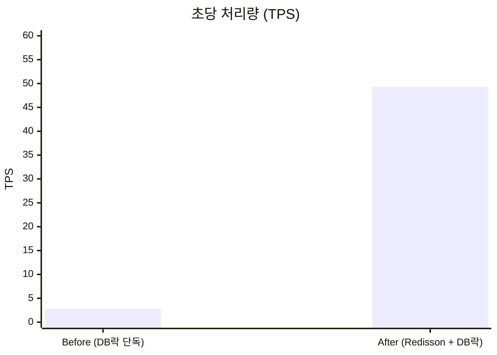
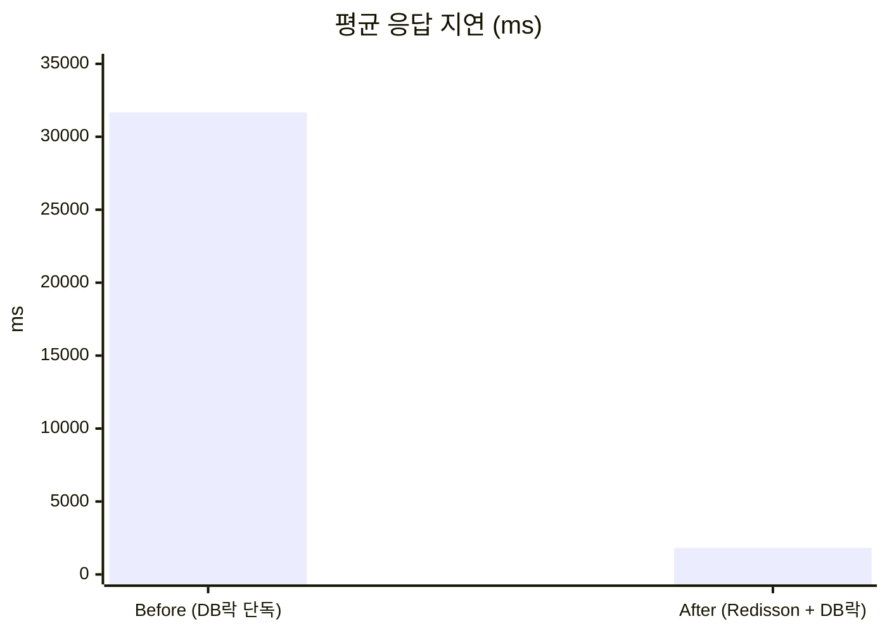
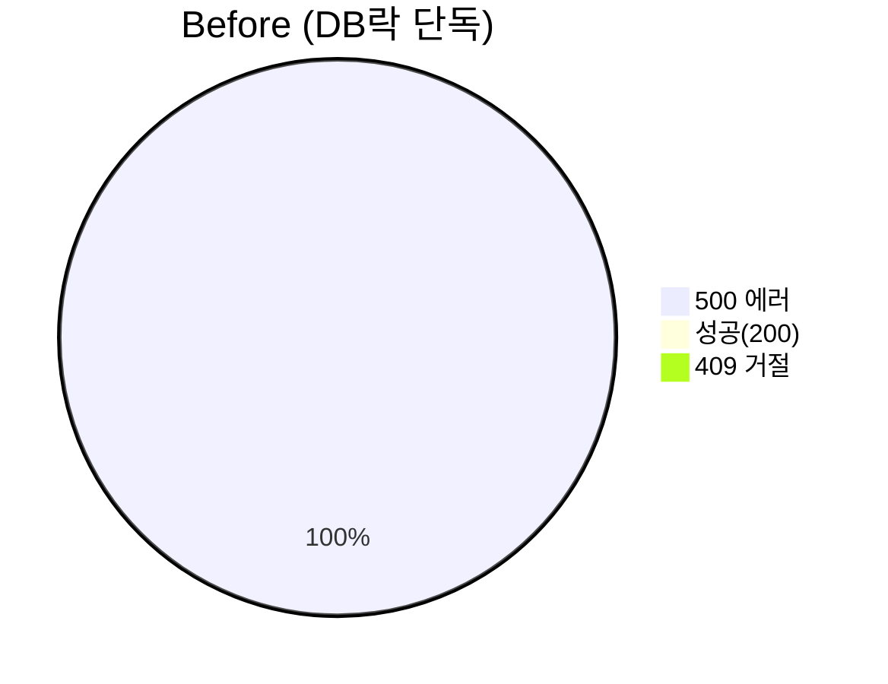
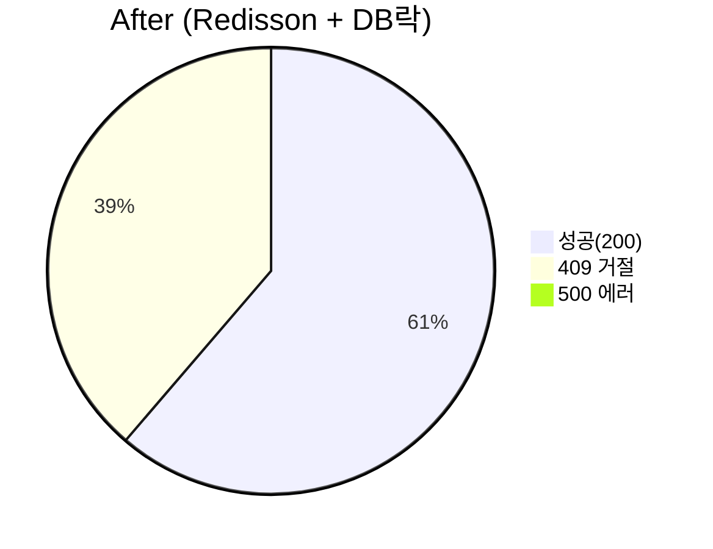
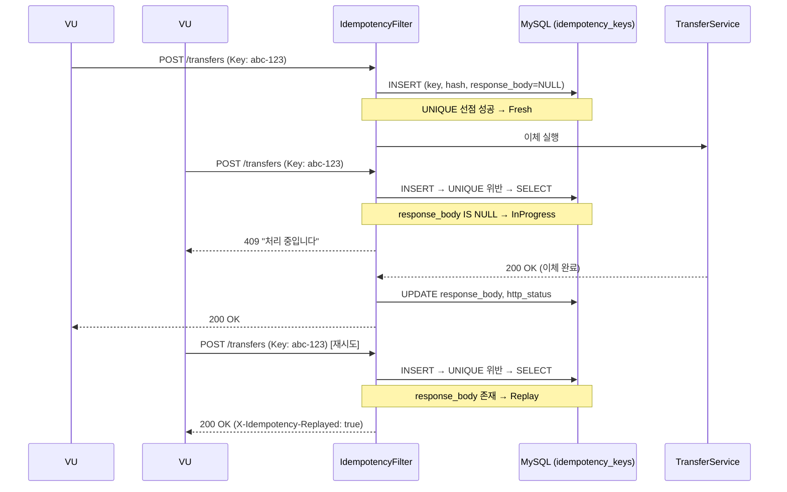

# Load Test

초기 구현(DB 비관적락 단독)에서 동시성 문제로 드러난 한계를 부하테스트로 수치화하고,
Redisson 분산락 도입 전후의 차이를 수치로 비교한다.

## 1. 배경 — 왜 부하테스트가 필요했나

이체(`/transfers`)는 최초 구현 시 `@Transactional` + `SELECT ... FOR UPDATE`(DB 비관적락)만으로 동시성을 방어했다.
기능 테스트는 통과했지만, **소수 계좌에 트래픽이 몰리는 상황**에서 실제로 잘 버티는지는 검증되지 않은 상태였다.
`docs/distributed-lock.md` §8의 "부하테스트 기반 TPS Before/After 측정" 항목을 채우기 위해,
초기 구현(Before)과 Redisson 도입 후(After)를 같은 시나리오로 측정했다.

| 구성 | 락 계층 | 브랜치 |
|---|---|---|
| **Before (초기 구현)** | DB 비관적락 단독 | `perf/db-lock-only` |
| **After  (개선 후)**   | Redisson + DB 비관적락 | `main` |

## 2. 사전 준비

- k6 설치 (`choco install k6` 또는 https://k6.io/docs/get-started/installation/)
- 서버 기동 (`./gradlew bootRun`), Redis 기동
- `docs/loadtest/results/` 디렉토리 생성 (결과 JSON 저장 위치)

setup 단계에서 테스트 유저·계좌를 자동 생성하므로 별도 시딩은 불필요하다.

## 3. 실행

```bash
# After (현재 main)
BASE_URL=http://localhost:8080 \
  k6 run --out json=results/after-raw.json \
  docs/loadtest/02-transfer-contention.js

# Before (DB락만 쓰는 브랜치로 체크아웃 후 서버 재기동)
git checkout perf/db-lock-only
# ... 서버 재기동
BASE_URL=http://localhost:8080 \
  k6 run --out json=results/before-raw.json \
  docs/loadtest/02-transfer-contention.js
```

경합 강도 조절: `ACCOUNT_POOL=2 k6 run ...` (풀이 작을수록 충돌 ↑)

## 4. 수집 지표

| 지표 | 의미 |
|---|---|
| `tps` (`http_reqs.rate`) | 초당 처리 건수 |
| `transfer_latency` p95/p99 | 사용자 체감 지연 |
| `transfer_success` | 성공 카운트 |
| `transfer_conflict_409` | 락 획득 실패(409) — 얼마나 빨리 거절했는가 |
| `conflict_rate` | 전체 요청 중 409 비율 |

## 5. 문제 상황 — 초기 구현(DB 비관적락)의 한계 (2026-04-16)

**측정 조건**: 계좌 풀 4개, ramping-vus 10→150, 4분, 로컬 환경 (단일 인스턴스)

| TPS | avg(ms) | P95(ms) | 성공(200) | 500 |
|---:|---:|---:|---:|---:|
| **2.76** | **31,677** | **50,277** | **0** | **651** |

- 요청당 평균 **31초** DB 커넥션 점유 → HikariCP 풀 포화 → 후속 요청 타임아웃
- 락 대기 타임아웃 초과 시 JPA `PessimisticLockException` → **500 전량**
- 앱 레벨에서의 빠른 거절이 없으니, 150 VU 전부가 DB 행락 대기열에 쌓이다가 한꺼번에 무너지는 구조

> ⚠️ 이 결과는 "DB 비관적락 자체가 나쁘다"는 의미가 아니라,
> **"빠른 거절(fast-rejection) 레이어 없이 단독 운용할 때의 붕괴 양상"** 을 보여준다.
> DB락도 `NOWAIT` + 예외 매핑으로 409를 만들 수는 있지만, 그 경우에도 **DB 커넥션/CPU를 소비**한다는 본질적 차이가 남는다.

## 6. 개선 결정 — 왜 Redisson 분산락인가

원인을 정리하면 "**락 대기가 DB 자원까지 점유**"하는 게 핵심이다. 해결 방향:
- **앱 레벨에서 먼저 직렬화** → 락을 못 잡은 요청은 DB에 도달조차 못함
- **3초 내 락 획득 실패 시 409로 빠르게 거절** → 클라이언트가 재시도 가능
- **락을 잡은 요청만 DB 트랜잭션을 염** → 커넥션은 실제 일하는 시간만큼만 점유

DB락은 **최후 방어선**(앱 크래시/여러 인스턴스 동시 락 획득 등 엣지)으로 남겨둔다.

## 7. 결과 — 개선 후 수치

| TPS | avg(ms) | P95(ms) | 성공(200) | 500 | 409 (빠른 거절) |
|---:|---:|---:|---:|---:|---:|
| **49.3** | **1,819** | **3,033** | **7,265** | **0** | **4,590** |

### 핵심 수치 (Before → After)

- **TPS 17.9배 향상** (2.76 → 49.3)
- **평균 지연 94% 감소** (31.7s → 1.8s)
- **P95 지연 94% 감소** (50.3s → 3.0s)
- **500 에러 0건** (Before 651건 → After 0건, 테스트 조건 기준)

### TPS 비교



### 평균 응답 지연 비교



### 응답 코드 분포





> 상세 시각화 리포트: [`report.html`](report.html)을 브라우저에서 열어 확인

## 8. 해석 가이드

- 409 비율 38.7%는 "나쁜 수치"가 아니다 — 락 대기 중 무한정 DB 자원을 잡는 대신 **빠르게 거절**하고 클라이언트가 재시도하게 하는 것이 설계 의도.
- Before/After 비교는 "두 구현의 공정 비교"가 아니라 **"초기 구현의 한계 → Redisson 도입으로 개선"** 이라는 개선 여정의 기록이다.

---

# Idempotency Test — 멱등성 검증 (`04-idempotency.js`)

## 목적

같은 `Idempotency-Key`로 N번 이체 요청을 보내도 **잔액은 1번만 변하는지** 검증한다.

## 실행

```bash
BASE_URL=http://localhost:8080 k6 run docs/loadtest/04-idempotency.js
```

## 측정 결과 (2026-04-19) — DB 기반 Store

**조건**: 20 VU x 5회 = 총 100건 요청, 동일 `Idempotency-Key` 사용

| 항목 | 값 |
|---|---|
| 총 요청 | 100건 |
| 실제 이체 처리 (최초 1건, Fresh) | 1건 |
| 재생 응답 반환 (Replay) | 54건 |
| 처리 중 동시 도착 거절 (InProgress, 409) | 45건 |
| 기타 에러 | **0건** |
| 잔액 변화 | 1,000,000 → 950,000 |
| 차감 금액 | **정확히 50,000 (1회분)** |
| `idempotencyVerified` | **true** |

### 동작 흐름



### 핵심

- 네트워크 재시도, 클라이언트 중복 클릭, 타임아웃 후 재전송 등 **어떤 경우에도 이체는 1번만 실행**
- 중복 요청은 캐시된 원본 응답을 그대로 반환 → 클라이언트는 정상 응답을 받음
- 처리 중 동시 도착 시 409로 즉시 거절 → 클라이언트가 재시도 가능
