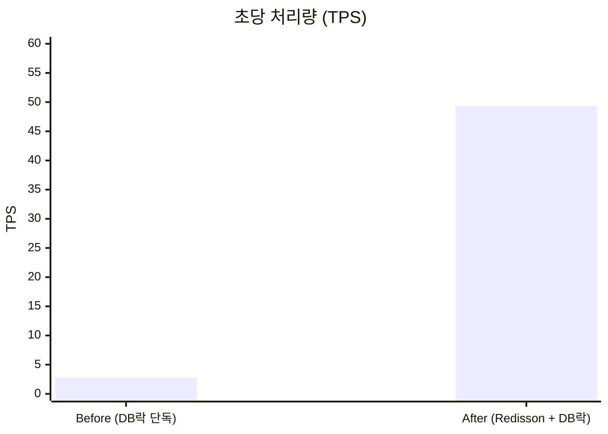
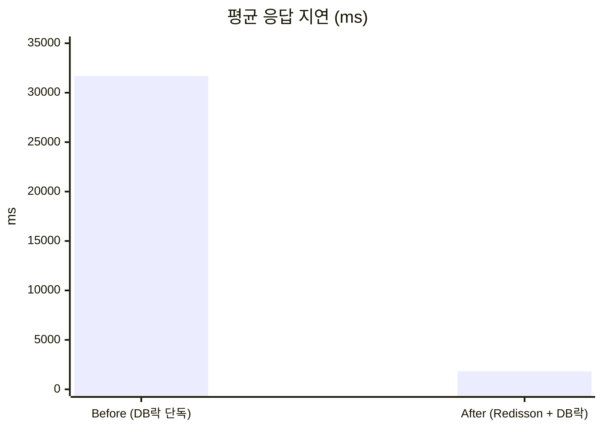
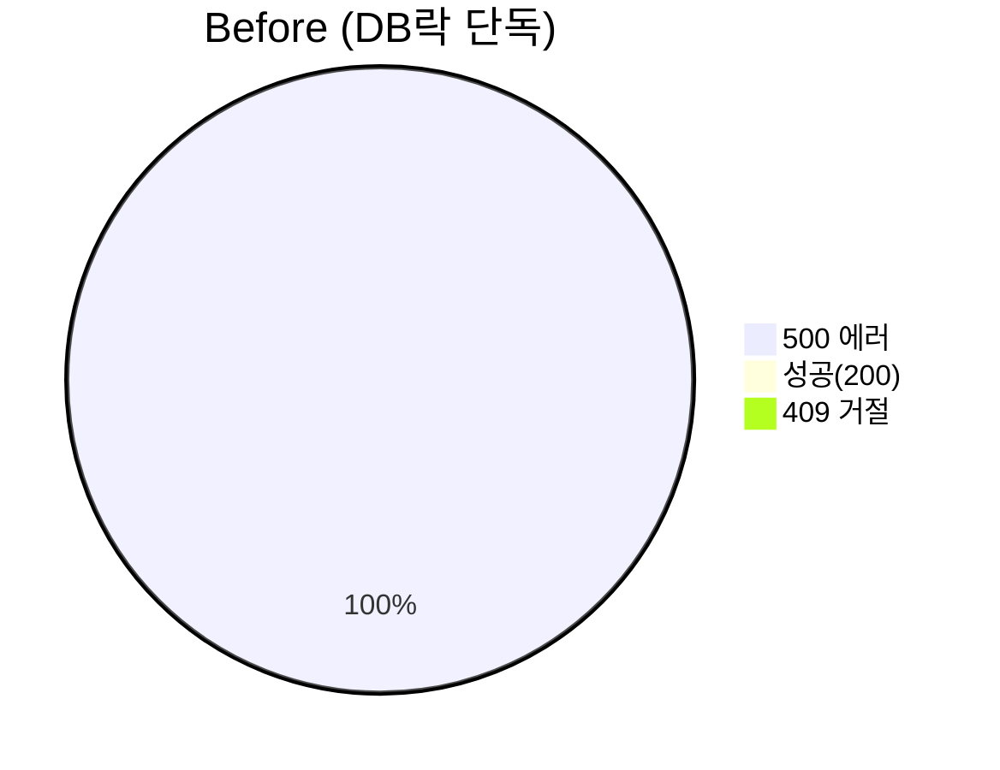
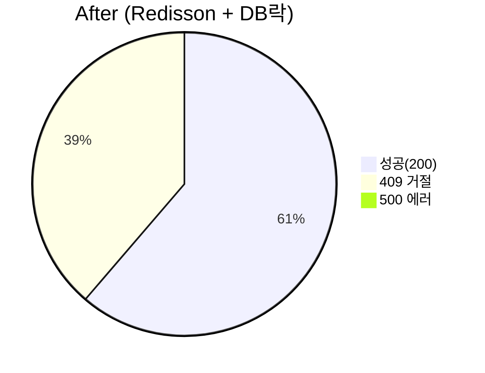
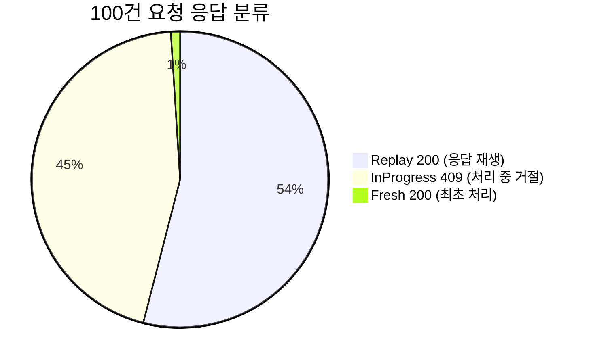
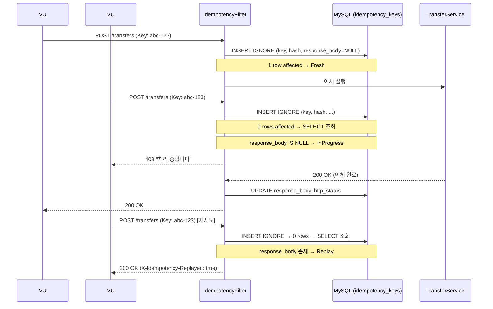

# Load Test

초기 구현(DB 비관적락 단독)에서 동시성 문제로 드러난 한계를 부하테스트로 수치화하고,
Redisson 분산락 도입 전후의 차이를 수치로 비교한다.

## 1. 배경 — 왜 부하테스트가 필요했나

이체(`/transfers`)는 최초 구현 시 `@Transactional` + `SELECT ... FOR UPDATE`(DB 비관적락)만으로 동시성을 방어했다.
기능 테스트는 통과했지만, **소수 계좌에 트래픽이 몰리는 상황**에서 실제로 잘 버티는지는 검증되지 않은 상태였다.
`docs/distributed-lock.md` §8의 "부하테스트 기반 TPS Before/After 측정" 항목을 채우기 위해,
초기 구현(Before)과 Redisson 도입 후(After)를 같은 시나리오로 측정했다.

| 구성 | 락 계층 | 브랜치 |
|---|---|---|
| **Before (초기 구현)** | DB 비관적락 단독 | `perf/db-lock-only` |
| **After  (개선 후)**   | Redisson + DB 비관적락 | `main` |

## 2. 사전 준비

- k6 설치 (`choco install k6` 또는 https://k6.io/docs/get-started/installation/)
- 서버 기동 (`./gradlew bootRun`), Redis 기동
- `docs/loadtest/results/` 디렉토리 생성 (결과 JSON 저장 위치)

setup 단계에서 테스트 유저·계좌를 자동 생성하므로 별도 시딩은 불필요하다.

## 3. 실행

```bash
# After (현재 main)
BASE_URL=http://localhost:8080 \
  k6 run --out json=results/after-raw.json \
  docs/loadtest/02-transfer-contention.js

# Before (DB락만 쓰는 브랜치로 체크아웃 후 서버 재기동)
git checkout perf/db-lock-only
# ... 서버 재기동
BASE_URL=http://localhost:8080 \
  k6 run --out json=results/before-raw.json \
  docs/loadtest/02-transfer-contention.js
```

경합 강도 조절: `ACCOUNT_POOL=2 k6 run ...` (풀이 작을수록 충돌 ↑)

## 4. 수집 지표

| 지표 | 의미 |
|---|---|
| `tps` (`http_reqs.rate`) | 초당 처리 건수 |
| `transfer_latency` p95/p99 | 사용자 체감 지연 |
| `transfer_success` | 성공 카운트 |
| `transfer_conflict_409` | 락 획득 실패(409) — 얼마나 빨리 거절했는가 |
| `conflict_rate` | 전체 요청 중 409 비율 |

## 5. 문제 상황 — 초기 구현(DB 비관적락)의 한계 (2026-04-16)

**측정 조건**: 계좌 풀 4개, ramping-vus 10→150, 4분, 로컬 환경 (단일 인스턴스)

| TPS | avg(ms) | P95(ms) | 성공(200) | 500 |
|---:|---:|---:|---:|---:|
| **2.76** | **31,677** | **50,277** | **0** | **651** |

- 요청당 평균 **31초** DB 커넥션 점유 → HikariCP 풀 포화 → 후속 요청 타임아웃
- 락 대기 타임아웃 초과 시 JPA `PessimisticLockException` → **500 전량**
- 앱 레벨에서의 빠른 거절이 없으니, 150 VU 전부가 DB 행락 대기열에 쌓이다가 한꺼번에 무너지는 구조

> ⚠️ 이 결과는 "DB 비관적락 자체가 나쁘다"는 의미가 아니라,
> **"빠른 거절(fast-rejection) 레이어 없이 단독 운용할 때의 붕괴 양상"** 을 보여준다.
> DB락도 `NOWAIT` + 예외 매핑으로 409를 만들 수는 있지만, 그 경우에도 **DB 커넥션/CPU를 소비**한다는 본질적 차이가 남는다.

## 6. 개선 결정 — 왜 Redisson 분산락인가

원인을 정리하면 "**락 대기가 DB 자원까지 점유**"하는 게 핵심이다. 해결 방향:
- **앱 레벨에서 먼저 직렬화** → 락을 못 잡은 요청은 DB에 도달조차 못함
- **3초 내 락 획득 실패 시 409로 빠르게 거절** → 클라이언트가 재시도 가능
- **락을 잡은 요청만 DB 트랜잭션을 염** → 커넥션은 실제 일하는 시간만큼만 점유

DB락은 **최후 방어선**(앱 크래시/여러 인스턴스 동시 락 획득 등 엣지)으로 남겨둔다.

## 7. 결과 — 개선 후 수치

| TPS | avg(ms) | P95(ms) | 성공(200) | 500 | 409 (빠른 거절) |
|---:|---:|---:|---:|---:|---:|
| **49.3** | **1,819** | **3,033** | **7,265** | **0** | **4,590** |

### 핵심 수치 (Before → After)

- **TPS 17.9배 향상** (2.76 → 49.3)
- **평균 지연 94% 감소** (31.7s → 1.8s)
- **P95 지연 94% 감소** (50.3s → 3.0s)
- **500 에러 0건** (Before 651건 → After 0건, 테스트 조건 기준)

### TPS 비교



### 평균 응답 지연 비교



### 응답 코드 분포





> 상세 시각화 리포트: [`report.html`](report.html)을 브라우저에서 열어 확인

## 8. 해석 가이드

- 409 비율 38.7%는 "나쁜 수치"가 아니다 — 락 대기 중 무한정 DB 자원을 잡는 대신 **빠르게 거절**하고 클라이언트가 재시도하게 하는 것이 설계 의도.
- Before/After 비교는 "두 구현의 공정 비교"가 아니라 **"초기 구현의 한계 → Redisson 도입으로 개선"** 이라는 개선 여정의 기록이다.

---

# Idempotency Test — 멱등성 검증 (`04-idempotency.js`)

## 목적

같은 `Idempotency-Key`로 N번 이체 요청을 보내도 **잔액은 1번만 변하는지** 검증한다.

## 실행

```bash
BASE_URL=http://localhost:8080 k6 run docs/loadtest/04-idempotency.js
```

## 측정 결과 (2026-04-19) — DB 기반 Store

**조건**: 20 VU x 5회 = 총 100건 요청, 동일 `Idempotency-Key` 사용

| 항목 | 값 |
|---|---|
| 총 요청 | 100건 |
| 실제 이체 처리 (최초 1건, Fresh) | 1건 |
| 재생 응답 반환 (Replay) | 54건 |
| 처리 중 동시 도착 거절 (InProgress, 409) | 45건 |
| 기타 에러 | **0건** |
| 잔액 변화 | 1,000,000 → 950,000 |
| 차감 금액 | **정확히 50,000 (1회분)** |
| `idempotencyVerified` | **true** |

### 응답 분포



### 동작 흐름



---

# 성능 튜닝 기록

*측정일: 2026-04-23.* 메인 README의 **"병목 분석과 성능 개선"** 섹션에서 요약한 실험의 상세 기록이다. 원시 수치, EXPLAIN 원문, 인덱스 후보 비교, 런별 결과를 보존한다.

## 측정 조건

- 시나리오: [`05-hikari-tuning.js`](05-hikari-tuning.js) — `02-transfer-contention.js`를 짧게 축소(ramping 10→80→150 VU, 총 ~2분)해 반복 측정에 쓰는 스크립트.
- 계좌 풀: 4개, 시드 잔액 1천만 원
- 환경: 로컬 단일 인스턴스, Dockerized MySQL 8 / Redis 7
- 반복: 구성마다 **2회** 측정 후 평균을 대표값
- 결과 파일 prefix: `results/<RUN_LABEL>-summary.json`

실행 예:
```bash
RUN_LABEL=limit-after-1 BASE_URL=http://localhost:8080 \
  k6 run --out json=results/limit-after-1-raw.json docs/loadtest/05-hikari-tuning.js
```

---

## 실험 1 — HikariCP 커넥션 풀 (결론: 주병목 아님)

### 가설
peak 150 VU에서 `maximumPoolSize=10`(Spring Boot 기본값)이 부족해 `connectionTimeout`/500이 발생할 것이다.

### baseline 측정 (pool=10, 설정 없음)

| Run | TPS | avg(ms) | p95(ms) | 성공 | 409 | 500 | conflict% |
|---|---:|---:|---:|---:|---:|---:|---:|
| before-1 | 35.22 | 2552 | 3179 | 1267 | 2303 | 0 | 64.5% |
| before-2 | 35.08 | 2587 | 3161 | 1189 | 2344 | 0 | 66.3% |

**관찰**
- `500` 0건, Hikari `connectionTimeout`/`ConnectionIsNotAvailable` 징후 없음.
- idle 상태에서 `SELECT VARIABLE_VALUE FROM performance_schema.global_status WHERE VARIABLE_NAME='Threads_connected';` → **11**. Hikari의 기본 `maximumPoolSize=10` + 모니터링 1. 풀 포화 없음.
- p95 3.16~3.18s는 Redisson `LOCK_WAIT_SECONDS=3`에 수렴 — **성공 요청 latency의 상한은 DB가 아니라 앱락 대기 시간이 정한다**.

### 튜닝 실험 (application.yml 적용)

```yaml
spring.datasource.hikari:
  maximum-pool-size: 30          # 10 → 30
  minimum-idle: 10
  connection-timeout: 3000       # 기본 30s → 3s
  idle-timeout: 600000
  max-lifetime: 1740000          # MySQL wait_timeout 하회
  leak-detection-threshold: 5000
  pool-name: HikariCP-Banking
```

각 값의 근거:
- `maximum-pool-size=30` — 150 VU 경합 피크에서 여유. MySQL `max_connections=151` 대비 안전한 상한.
- `connection-timeout=3000` — 이체 타임버짓(락 대기 3s + 트랜잭션) 밖에서 커넥션을 30초 기다리는 건 장애 전파만 키움 → fast-fail.
- `leak-detection-threshold=5000` — 정상 이체는 커넥션 1초 이내 반납. 5초 초과 시 경고로 코드 누수 조기 감지.

### after 측정 (pool=30)

| Run | TPS | avg(ms) | p95(ms) | 성공 | 409 | 500 | conflict% |
|---|---:|---:|---:|---:|---:|---:|---:|
| after-1 | 33.10 | 2717 | 3355 | 1032 | 2338 | 0 | 69.4% |
| after-2 | 32.07 | 2821 | 3431 |  886 | 2364 | 0 | 72.7% |

### 결론

| 지표 | before (pool=10) | after (pool=30) | Δ |
|---|---:|---:|---:|
| TPS | 35.15 | 32.59 | **-7.3%** |
| avg latency | 2570 ms | 2769 ms | **+7.7%** |
| p95 latency | 3170 ms | 3393 ms | +7.0% |
| 500 | 0 | 0 | 동일 |

**역효과**. 앞단 Redisson이 대다수 요청을 3초 내 409로 거절해 DB에 닿는 요청이 적고, pool을 확대하자 동시 DB 트랜잭션 수가 늘어 MySQL 행락 경합만 증가. **HikariCP는 이 워크로드에서 주병목이 아니다**.

**반영 결정**
- `maximum-pool-size` 확대는 이득 없음 → 다음 실험부터는 이 값을 고정한 채 다른 후보 측정. 관측성/안정성 설정(`connection-timeout=3s`, `leak-detection-threshold=5s`, `max-lifetime=29m`)은 값의 근거가 있어 `application.yml`에 유지.
- 원시 run JSON: `results/hikari-before-{1,2}-summary.json`, `results/hikari-after-{1,2}-summary.json`

---

## 실험 2 — 거래 한도 SUM 쿼리 (결론: 개선 있음)

### 대상

`TransferService.doTransfer()`가 락 획득 후 매번 호출하는 `TransactionLimitPolicy.validate()` 내부의 일일 집계 쿼리.

```sql
SELECT COALESCE(SUM(amount), 0) FROM transaction
WHERE account_id = ?
  AND type IN ('WITHDRAW', 'TRANSFER_OUT')
  AND created_at >= ? AND created_at < ?;
```

**write path 쿼리 비용 검토 관점**에서: 이 쿼리는 모든 이체 **성공** 경로에서 실행되며, 실행이 느릴수록 성공 요청이 락을 오래 잡아 뒤따르는 요청의 락 획득률을 떨어뜨린다.

### EXPLAIN before (인덱스 = FK `account_id`만)

계좌당 rows가 많은 `account_id=28` 기준:
```
type=ref  key=FK6g20fcr3bhr6bihgy24rq1r1b  rows=1195  filtered=5.55%  Extra=Using where
```
account_id로는 인덱스 접근하지만 **`type`/`created_at` 필터링은 레코드 접근 후 서버에서 수행**(`Using where`). `filtered 5.55%`가 스캔 낭비를 시사.

### 인덱스 후보 비교

둘 다 만들어 `USE INDEX`로 강제 비교:

| 후보 | type | rows | filtered | Extra |
|---|---|---:|---:|---|
| (A) `(account_id, created_at)` | range | 1195 | 50% | `Using index condition; Using where` |
| **(B) `(account_id, type, created_at)`** | **range** | **553** | **100%** | `Using index condition` |
| no hint (옵티마이저 선택) | range | 553 | 100% | **→ B 채택** |

- (A)는 ICP로 `type`을 push-down해도 `Using where`가 남아 서버 필터링 잔존.
- (B)는 인덱스 레벨에서 `type IN` 2값을 multi-seek로 분기해 인덱스 밖 필터링 없음(`filtered=100%`). 스캔 rows가 약 55% 감소(1195→553).
- **선정: (B)**. 이번 작업의 핵심 목표가 SUM 쿼리 비용 개선이므로 더 직접적인 후보를 택함. 옵티마이저도 자연스레 (B) 선택.

### 적용

```sql
CREATE INDEX idx_tx_acc_type_createdat ON transaction (account_id, type, created_at);
```
코드에도 `Transaction` 엔티티 `@Table(indexes=...)` 선언으로 남김.

### EXPLAIN after
```
type=range  key=idx_tx_acc_type_createdat  key_len=18  rows=553  filtered=100.00  Extra=Using index condition
```
`Using where` 제거, filtered 100%.

### k6 before/after (Hikari 설정 고정, 인덱스만 변경)

| Run | TPS | avg(ms) | p95(ms) | 성공 | 409 | 500 | conflict% |
|---|---:|---:|---:|---:|---:|---:|---:|
| limit-before-1 (no idx) | 35.92 | 2500 | 3154 | 1386 | 2262 | 0 | 62.0% |
| limit-before-2 (no idx) | 37.95 | 2370 | 3131 | 1628 | 2200 | 0 | 57.5% |
| **limit-after-1** (idx B) | **39.68** | **2278** | 3127 | **1818** | 2174 | 0 | 54.5% |
| **limit-after-2** (idx B) | **41.84** | **2146** | 3110 | **2185** | 2026 | 0 | 48.1% |

### 대표값 (2회 평균)

| 지표 | before | after | Δ |
|---|---:|---:|---:|
| TPS | 36.93 | 40.76 | **+10.4%** |
| avg latency | 2435 ms | 2212 ms | **-9.2%** |
| p95 latency | 3143 ms | 3119 ms | -0.8% |
| 성공 건수 | 1507 | 2002 | **+33%** |
| 409 비율 | 59.8% | 51.3% | -8.5%p |

### 해석

- **TPS/avg/성공 건수 개선** — 인덱스 변경이 유일한 단일 변수이고 4개 런 모두 일관된 방향(before < after).
- **p95 거의 무변화** — Redisson `LOCK_WAIT_SECONDS=3`이 tail latency의 상한을 정하므로 SUM 쿼리를 빠르게 해도 "락 대기 끝에 거절되는 요청"의 체감 지연은 줄지 않음.
- **성공 건수 +33%의 메커니즘** — SUM이 빨라져 성공 요청이 락을 더 짧게 잡고 나가고, 뒤따르는 요청의 락 획득 확률이 오르며 `conflict%`가 59.8%→51.3%로 감소. **write path 쿼리 비용 최적화가 락 경합 완화로 간접 전파**되는 전형적 패턴.
- **원시 run JSON**: `results/limit-before-{1,2}-summary.json`, `results/limit-after-{1,2}-summary.json`

### 한계

- 2회 반복만으로는 JIT warmup · InnoDB buffer pool warming 등의 런타임 노이즈를 완전히 배제하기 어렵다. 변화의 **방향**은 명확하지만 폭(±2 TPS)은 더 많은 런으로 좁혀야 한다.
- `transaction` 테이블 행 수가 약 1만 수준이라 스캔 절감 효과의 절대값은 크지 않다. 데이터 규모가 커질수록 인덱스의 효과가 더 분명해질 가능성이 있다.
- 테스트는 로컬 단일 인스턴스. 다중 인스턴스/네트워크 지연 환경에서는 다른 지점(분산 락 RTT, Redis 경합)이 병목으로 부상할 수 있다.
- 정합성 민감 경로(이체·잔액·한도)에는 stale read 위험 때문에 캐시를 적용하지 않았다.
